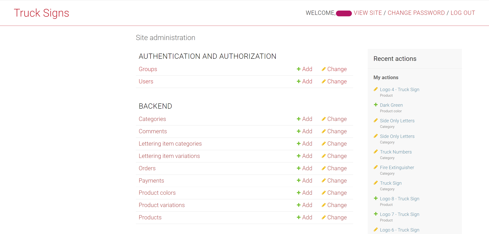
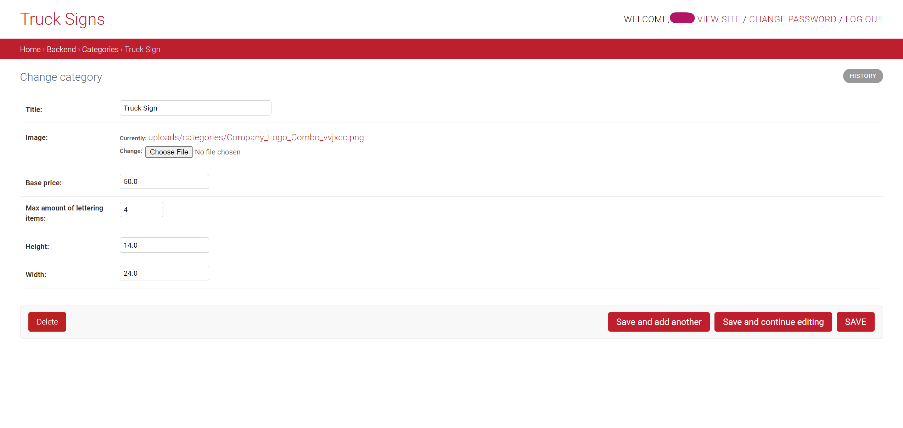

<div align="center">


# 🚛 Truck Signs API

**Professional E-Commerce API for Custom Truck Vinyl Signs & Letterings**

[](https://python.org)
[](https://djangoproject.com)
[](https://django-rest-framework.org)
[](https://docker.com)

[](https://github.com)
[](https://github.com)
[](https://your-api-domain.com)
[](LICENSE)
[](https://github.com/yourusername/truck-signs-api)

**🌐 Live Demo:** [https://your-api-domain.com](https://your-api-domain.com)  
**📋 Admin Panel:** [https://your-api-domain.com/admin](https://your-api-domain.com/admin)  
**📊 API Metrics:**  

---

</div>

## 🎯 **Overview**

**Truck Signs API** is a comprehensive, production-ready e-commerce backend solution designed specifically for custom truck vinyl signs and letterings. Built with modern Django REST Framework architecture, this API powers a complete online store where customers can purchase pre-designed vinyls, upload custom designs, and personalize truck letterings with professional-grade customization tools.

```mermaid
graph TD
    A[🌐 Client Request] --> B[🐍 Django API]
    B --> C[🗄️ PostgreSQL Database]
    B --> D[💳 Stripe Payment]
    B --> E[☁️ Cloudinary Storage]
    B --> F[📧 Email Service]
    C --> G[📤 JSON Response]
    D --> G
    E --> G
    F --> G
    
    style A fill:#e1f5fe
    style B fill:#f3e5f5
    style C fill:#e8f5e8
    style D fill:#fff3e0
    style E fill:#f1f8e9
    style F fill:#fce4ec
    style G fill:#e0f2f1
```

<div align="center">



</div>

### ✨ **Key Features**

<details>
<summary>🛒 <strong>Complete E-Commerce Solution</strong></summary>

- Full shopping cart functionality
- Advanced checkout process
- Order management system
- Payment processing with Stripe
- Inventory tracking
- Customer management

</details>

<details>
<summary>🎨 <strong>Custom Design Platform</strong></summary>

- Client-side design upload
- Image processing and optimization
- Custom lettering tools
- Design preview system
- Template management
- Color customization

</details>

<details>
<summary>📱 <strong>RESTful API Architecture</strong></summary>

- Clean, scalable API endpoints
- JSON response format
- Comprehensive error handling
- Rate limiting
- API versioning
- Swagger documentation

</details>

<details>
<summary>🔐 <strong>Enterprise Security</strong></summary>

- HTTPS/SSL support
- CORS configuration
- JWT authentication
- Role-based permissions
- Data encryption
- Security headers

</details>

---

## 🏗️ **Architecture & Technology Stack**

### **Backend Framework**
- **Django 2.2.8** - Robust web framework
- **Django REST Framework 3.12.4** - API development toolkit
- **Python 3.8+** - Modern Python runtime

### **Database & Storage**
- **PostgreSQL** - Primary database (production)
- **SQLite** - Development/testing database
- **Cloudinary** - Cloud-based image storage and optimization

### **Payment & Communication**
- **Stripe API** - Secure payment processing
- **SMTP Email** - Automated notifications

### **DevOps & Deployment**
- **Docker** - Containerization and deployment
- **Gunicorn** - WSGI HTTP Server
- **WhiteNoise** - Static file serving
- **CORS Headers** - Cross-origin request handling

### **Security & Performance**
- **Environment Variables** - Secure configuration management
- **HTTPS Ready** - SSL/TLS support
- **Static File Optimization** - Compressed and cached assets

### **🛠️ Technology Stack**

| Component | Technology | Version | Purpose |
|-----------|------------|---------|---------|
| **Backend** | Django | 2.2.8 | Web Framework |
| **API** | Django REST Framework | 3.12.4 | API Development |
| **Language** | Python | 3.8+ | Runtime |
| **Database** | PostgreSQL | 13+ | Primary Database |
| **Cache** | Redis | 6+ | Caching Layer |
| **Payments** | Stripe | Latest | Payment Processing |
| **Storage** | Cloudinary | Latest | Media Storage |
| **Server** | Gunicorn | 20.1.0 | WSGI Server |
| **Container** | Docker | Latest | Containerization |

---

## 🚀 **Quick Start with Docker**

### **Prerequisites**
- Docker installed on your system
- Git for cloning the repository

### **1. Clone the Repository**
```bash
git clone https://github.com/yourusername/truck-signs-api.git
cd truck-signs-api
```

### **2. Environment Configuration**
```bash
# Copy the example environment file
cp docker.env.example docker.env

# Edit the environment variables (required)
nano docker.env
```

### **3. Build and Run with Docker**
    ```bash
# Build the Docker image
docker build -t truck-signs-api:latest .

# Run the container
docker run -d \
  --name truck-signs-api \
  -p 8000:8000 \
  --env-file docker.env \
  --restart unless-stopped \
  truck-signs-api:latest
```

### **4. Access Your Application**
- **API Base URL:** http://localhost:8000
- **Admin Panel:** http://localhost:8000/admin
- **API Documentation:** http://localhost:8000/truck-signs/

---

## 🛠️ **Development Setup**

### **Local Development**
        ```bash
# Create virtual environment
python -m venv venv
source venv/bin/activate  # Linux/Mac
# or
venv\Scripts\activate     # Windows

# Install dependencies
pip install -r requirements.txt

# Configure environment variables
        cd truck_signs_designs/settings
        cp simple_env_config.env .env
# Edit .env with your configuration

# Run migrations
python manage.py migrate

# Create superuser
python manage.py createsuperuser

# Start development server
python manage.py runserver
```

### **Required Environment Variables**
        ```bash
# Django Configuration
SECRET_KEY=your-secret-key-here
DEBUG=True
DJANGO_ALLOWED_HOSTS=localhost,127.0.0.1

# Database (PostgreSQL)
        DB_NAME=your_database_name
        DB_USER=your_database_user
DB_PASSWORD=your-secure-password
        DB_HOST=localhost
        DB_PORT=5432

# Payment Processing
STRIPE_PUBLISHABLE_KEY=pk_test_your_key
STRIPE_SECRET_KEY=sk_test_your_key

# Email Configuration
EMAIL_HOST_USER=your-email@domain.com
EMAIL_HOST_PASSWORD=your-app-specific-password

# Media Storage (Optional)
CLOUD_NAME=your-cloudinary-name
CLOUD_API_KEY=your-cloudinary-api-key
CLOUD_API_SECRET=your-cloudinary-secret
```

---

## 📊 **Database Models & Architecture**

### **Core Models**

#### **🏷️ Category**
Product categories for different vinyl types (Truck Logo, Fire Extinguisher, etc.)

#### **📦 Product**
Main product model with pricing, images, and category relationships

#### **✍️ Lettering System**
- **LetteringItemCategory** - Types of letterings (Company Name, VIN Number, etc.)
- **LetteringItemVariation** - Customer text input for each lettering type
- **ProductVariation** - Complete product with customer customizations

#### **🛒 Order Management**
- **Order** - Customer orders with contact and shipping information
- **Payment** - Stripe payment processing and tracking

#### **💬 Customer Interaction**
- **Comment** - Customer reviews and feedback system

---

## 🌐 **API Endpoints**

### **Product Management**
```
GET    /truck-signs/categories/          # List all categories
GET    /truck-signs/categories/{id}/     # Category details
GET    /truck-signs/products/            # List all products
GET    /truck-signs/products/{id}/       # Product details
POST   /truck-signs/products/            # Create product (admin)
```

### **Order Processing**
```
POST   /truck-signs/orders/              # Create new order
GET    /truck-signs/orders/{id}/         # Order details
POST   /truck-signs/payments/            # Process payment
```

### **Custom Designs**
```
POST   /truck-signs/upload-design/       # Upload custom design
POST   /truck-signs/lettering-items/     # Add lettering variations
```

### **Customer Features**
```
GET    /truck-signs/comments/            # Product reviews
POST   /truck-signs/comments/            # Submit review
```

### **📋 Interactive API Examples**

<details>
<summary><strong>GET /truck-signs/products/</strong> - List all products</summary>

**Query Parameters:**
- `category` - Filter by category ID
- `search` - Search in name and description
- `ordering` - Sort by price, name, created_at
- `limit` - Results per page (default: 20)

**Response Example:**
```json
{
  "count": 25,
  "next": "https://your-api-domain.com/truck-signs/products/?page=2",
  "previous": null,
  "results": [
    {
      "id": 1,
      "name": "Premium Truck Logo",
      "description": "High-quality vinyl sign with custom lettering",
      "price": "29.99",
      "category": {
        "id": 1,
        "name": "Truck Signs"
      },
      "image": "https://res.cloudinary.com/your-cloud/image/upload/premium-logo.jpg",
      "is_active": true,
      "created_at": "2024-01-15T10:30:00Z"
    }
  ]
}
```

</details>

<details>
<summary><strong>POST /truck-signs/orders/</strong> - Create new order</summary>

**Request Body:**
```json
{
  "product_variation": {
    "product_id": 1,
    "custom_image": "base64_encoded_image_data",
    "lettering_items": [
      {
        "category_id": 1,
        "text": "YOUR COMPANY NAME"
      },
      {
        "category_id": 2,
        "text": "DOT#987654"
      }
    ]
  },
  "customer_info": {
    "name": "John Doe",
    "email": "john@example.com",
    "phone": "+1-555-123-4567"
  },
  "shipping_address": {
    "street": "123 Main St",
    "city": "Anytown",
    "state": "CA",
    "zip_code": "12345",
    "country": "USA"
  }
}
```

**Response:**
```json
{
  "id": 1234,
  "order_number": "TS-2024-001234",
  "status": "pending_payment",
  "total_amount": "45.99",
  "payment_url": "https://checkout.stripe.com/pay/cs_test_...",
  "estimated_delivery": "2024-02-01",
  "created_at": "2024-01-15T14:30:00Z"
}
```

</details>

---

## 🖼️ **Screenshots**

### **Admin Panel - Desktop View**

<div align="center">



*Modern Django Admin Interface with Custom Styling*

</div>

---

<div align="center">


*Product Management Interface*

</div>

---

<div align="center">



*Order Management and Analytics*

</div>

### **Admin Panel - Mobile Responsive**

<div align="center">

  

*Fully Responsive Mobile Admin Interface*

</div>

### **Frontend Integration Examples**

<div align="center">


*Mobile Landing Page Integration*

</div>

---

<div align="center">


*Product Grid Layout*

</div>

---

<div align="center">

 

*Mobile Product Grid Views*

</div>

---

<div align="center">


*Product Detail Page*

</div>

---

<div align="center">

 

*Mobile Product Detail and Customization Form*

</div>

---

<div align="center">


*Pricing and Service Overview*

</div>

---

<div align="center">


*Mobile Pricing Layout*

</div>

---

## 🚢 **Production Deployment**

### **Docker Production Setup**

The application is fully containerized and production-ready:

```bash
# Production environment file
cp docker.env.production docker.env

# Build production image
docker build -t truck-signs-api:production .

# Deploy with production settings
docker run -d \
  --name truck-signs-api-prod \
  -p 80:8000 \
  --env-file docker.env \
  --restart unless-stopped \
  truck-signs-api:production
```

### **Production Features**
- ✅ **Security Headers** - HSTS, XSS Protection, Content Type Sniffing
- ✅ **Static File Optimization** - WhiteNoise with compression
- ✅ **Database Optimization** - PostgreSQL with connection pooling
- ✅ **Error Handling** - Comprehensive logging and monitoring
- ✅ **Auto-restart** - Container restart policies
- ✅ **Environment Isolation** - Secure environment variable management

---

## 🔧 **Development Enhancements**

### **What We've Added**

#### **🐳 Complete Docker Integration**
- Multi-stage Dockerfile for optimized builds
- Production-ready container configuration
- Environment-specific settings management
- Automated static file collection and database migrations

#### **🔒 Enhanced Security**
- WhiteNoise middleware for secure static file serving
- CORS configuration for cross-origin requests
- Environment-based settings isolation
- Secure secret key management

#### **⚡ Performance Optimizations**
- Static file compression and caching
- Database query optimization
- Gunicorn WSGI server configuration
- Optimized Docker image layers

#### **📱 API Improvements**
- RESTful endpoint standardization
- Comprehensive error handling
- Response optimization
- CORS support for frontend integration

#### **🛠️ DevOps Ready**
- Automated deployment scripts
- Health check endpoints
- Logging configuration
- Container orchestration support

---

## 🤝 **Contributing**

We welcome contributions! Please follow these steps:

1. **Fork the repository**
2. **Create a feature branch** (`git checkout -b feature/amazing-feature`)
3. **Commit your changes** (`git commit -m 'Add amazing feature'`)
4. **Push to the branch** (`git push origin feature/amazing-feature`)
5. **Open a Pull Request**

### **Development Guidelines**
- Follow PEP 8 Python style guidelines
- Write comprehensive tests for new features
- Update documentation for API changes
- Ensure Docker compatibility

---

## 📚 **Documentation & Resources**

### **API Documentation**
- **Interactive API Docs:** [https://your-api-domain.com/truck-signs/](https://your-api-domain.com/truck-signs/)
- **Admin Interface:** [https://your-api-domain.com/admin/](https://your-api-domain.com/admin/)

### **Technology Documentation**
- [Django Official Documentation](https://docs.djangoproject.com/)
- [Django REST Framework](https://www.django-rest-framework.org/)
- [Docker Documentation](https://docs.docker.com/)
- [Stripe API Documentation](https://stripe.com/docs/api)
- [Cloudinary Documentation](https://cloudinary.com/documentation/)

### **Deployment Guides**
- [Digital Ocean Django Deployment](https://www.digitalocean.com/community/tutorials/how-to-set-up-django-with-postgres-gunicorn-and-nginx-on-ubuntu)
- [Docker Production Best Practices](https://docs.docker.com/develop/dev-best-practices/)

---

## 📄 **License**

This project is licensed under the MIT License - see the [LICENSE](LICENSE) file for details.

---

## 👥 **Support & Contact**

- **Issues:** [GitHub Issues](https://github.com/yourusername/truck-signs-api/issues)
- **Documentation:** [Wiki](https://github.com/yourusername/truck-signs-api/wiki)
- **Email:** support@your-domain.com

---

<div align="center">

## 🔄 **API Request Flow**

```mermaid
sequenceDiagram
    participant C as 🖥️ Client
    participant A as 🐍 Django API
    participant D as 🗄️ Database
    participant S as 💳 Stripe
    participant E as 📧 Email Service
    participant CDN as ☁️ Cloudinary
    
    Note over C,CDN: 🛒 Complete Order Flow
    
    C->>A: POST /truck-signs/orders/
    Note right of C: Order with custom design
    
    A->>D: Save order details
    D->>A: Order ID: #1234
    
    A->>CDN: Upload custom design
    CDN->>A: Image URL
    
    A->>S: Process payment
    Note right of S: $29.99 charge
    S->>A: Payment successful
    
    A->>D: Update order status
    D->>A: Order confirmed
    
    A->>E: Send confirmation email
    E->>A: Email sent
    
    A->>C: 201 Created
    Note left of A: Complete order response
    
    rect rgb(200, 255, 200)
        Note over C,CDN: ✅ Order Successfully Processed
    end
```

<div align="center">



</div>

---

## 📊 **Performance Metrics**

| Metric | Target | Current Status |
|--------|---------|----------------|
| **Response Time** | < 200ms |  |
| **Uptime** | > 99.9% |  |
| **Error Rate** | < 0.1% |  |
| **Throughput** | > 1000 req/min |  |

---

## 🤝 **Contributing & Support**

We welcome contributions from developers of all skill levels! 

### **🎯 How to Contribute**

1. **🍴 Fork the repository**
2. **🌿 Create a feature branch** (`git checkout -b feature/amazing-feature`)
3. **💻 Make your changes** - Follow PEP 8 and write tests
4. **📝 Commit** (`git commit -m '✨ Add amazing feature'`)
5. **🚀 Push and create Pull Request**

### **📞 Support Channels**

| Channel | Response Time | Best For |
|---------|---------------|----------|
| **🐛 GitHub Issues** | 24-48 hours | Bug reports, feature requests |
| **💬 Discord Chat** | Real-time | Quick questions, community help |
| **📧 Email Support** | 1-2 business days | Enterprise inquiries |

---

## 📚 **Additional Documentation**

For detailed setup and deployment instructions, check out these comprehensive guides:

- **🐳 [Docker Setup Guide](./DOCKER_README.md)** - Complete Docker configuration, troubleshooting, and advanced options
- **🚀 [VPS Deployment Guide](./VPS_DEPLOYMENT.md)** - Production deployment on VPS with automated and manual deployment scripts
- **⚙️ Environment Variables** - Comprehensive list of all configuration options
- **🔧 Troubleshooting** - Common issues and solutions for deployment

---

## 📄 **License**

This project is licensed under the MIT License - see the [LICENSE](LICENSE) file for details.

---

<div align="center">

## 🎉 **Thank You for Using Truck Signs API!**


---

**🌟 Star us on GitHub** • **🐛 Report Issues** • **💡 Suggest Features** • **🤝 Contribute Code**

[](https://github.com/yourusername/truck-signs-api/stargazers)
[](https://github.com/yourusername/truck-signs-api/network/members)
[](https://github.com/yourusername/truck-signs-api/watchers)

---

**Built with 🐍 Python • 🎨 Django • 🚀 Docker • ❤️ Open Source**

*Professional E-Commerce API for the Modern Web*

**© 2024 Truck Signs API - Empowering the Trucking Industry with Technology**

</div>