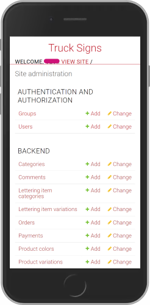
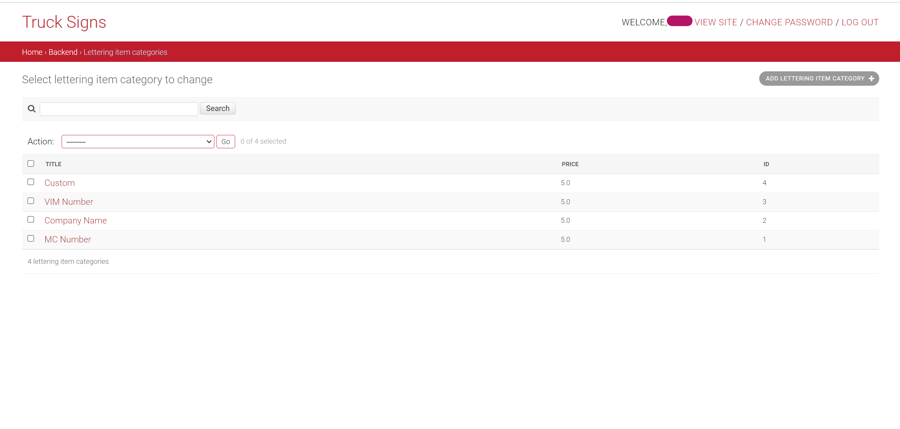

<div align="center">


# Signs for Trucks

  


</div>

## Table of Contents
* [Description](#description)
* [Installation](#installation)
* [Screenshots of the Django Backend Admin Panel](#screenshots)
* [Useful Links](#useful_links)


## Description

__Signs for Trucks__ is an online store to buy pre-designed vinyls with custom lines of letters (often call truck letterings). The store also allows clients to upload their own designs and to customize them on the website as well. Aside from the vinyls that are the main product of the store, clients can also purchase simple lettering vinyls with no truck logo, a fire extinguisher vinyl, and/or a vinyl with only the truck unit number (or another number selected by the client).

### Settings

The __settings__ folder inside the trucks_signs_designs folder contains the different setting's configuration for each environment (so far the environments are development, docker testing, and production). Those files are extensions of the base.py file which contains the basic configuration shared among the different environments (for example, the value of the template directory location). In addition, the .env file inside this folder has the environment variables that are mostly sensitive information and should always be configured before use. By default, the environment in use is the decker testing. To change between environments modify the \_\_init.py\_\_ file.

### Models

Most of the models do what can be inferred from their name. The following dots are notes about some of the models to make clearer their propose:
- __Category Model:__ The category of the vinyls in the store. It contains the title of the category as well as the basic properties shared among products that belong to a same category. For example, _Truck Logo_ is a category for all vinyls that has a logo of a truck plus some lines of letterings (note that the vinyls are instances of the model _Product_). Another category is _Fire Extinguisher_, that is for all vinyls that has a logo of a fire extinguisher. 
- __Lettering Item Category:__ This is the category of the lettering, for example: _Company Name_, _VIM NUMBER_, ... Each has a different pricing.
- __Lettering Item Variations:__ This contains a foreign key to the __Lettering Item Category__ and the text added by the client.
- __Product Variation:__ This model has the original product as a foreign key, plus the lettering lines (instances of the __Lettering Item Variations__ model) added by the client.
- __Order:__ Contains the cart (in this case the cart is just a vinyl as only one product can be purchased each time). It also contains the contact and shipping information of the client.
- __Payment:__ It has the payment information such as the time of the purchase and the client id in Stripe.

To manage the payments, the payment gateway in use is [Stripe](https://stripe.com/).

### Brief Explanation of the Views

Most of the views are CBV imported from _rest_framework.generics_, and they allow the backend api to do the basic CRUD operations expected, and so they inherit from the _ListAPIView_, _CreateAPIView_, _RetrieveAPIView_, ..., and so on.

The behavior of some of the views had to be modified to address functionalities such as creation of order and payment, as in this case, for example, both functionalities are implemented in the same view, and so a _GenericAPIView_ was the view from which it inherits. Another example of this is the _UploadCustomerImage_ View that takes the vinyl template uploaded by the clients and creates a new product based on it.

## Installation

1. Clone the repo:
    ```bash
    git clone <INSERT URL>
    ```
1. Configure a virtual env and set up the database. See [Link for configuring Virtual Environment](https://docs.python-guide.org/dev/virtualenvs/) and [Link for Database setup](https://www.digitalocean.com/community/tutorials/how-to-set-up-django-with-postgres-nginx-and-gunicorn-on-ubuntu-16-04).
1. Configure the environment variables.
    1. Copy the content of the example env file that is inside the truck_signs_designs folder into a .env file:
        ```bash
        cd truck_signs_designs/settings
        cp simple_env_config.env .env
        ```
    1. The new .env file should contain all the environment variables necessary to run all the django app in all the environments. However, the only needed variables for the development environment to run are the following:
        ```bash
        SECRET_KEY
        DB_NAME
        DB_USER
        DB_PASSWORD
        DB_HOST
        DB_PORT
        STRIPE_PUBLISHABLE_KEY
        STRIPE_SECRET_KEY
        EMAIL_HOST_USER
        EMAIL_HOST_PASSWORD
        ```
    1. For the database, the default configurations should be:
        ```bash
        DB_NAME=trucksigns_db
        DB_USER=trucksigns_user
        DB_PASSWORD=supertrucksignsuser!
        DB_HOST=localhost
        DB_PORT=5432
        ```
    1. The SECRET_KEY is the django secret key. To generate a new one see: [Stackoverflow Link](https://stackoverflow.com/questions/41298963/is-there-a-function-for-generating-settings-secret-key-in-django)

    1. **NOTE: not required for exercise**<br/>The STRIPE_PUBLISHABLE_KEY and the STRIPE_SECRET_KEY can be obtained from a developer account in [Stripe](https://stripe.com/). 
        - To retrieve the keys from a Stripe developer account follow the next instructions:
            1. Log in into your Stripe developer account (stripe.com) or create a new one (stripe.com > Sign Up). This should redirect to the account's Dashboard.
            1. Go to Developer > API Keys, and copy both the Publishable Key and the Secret Key.

    1. The EMAIL_HOST_USER and the EMAIL_HOST_PASSWORD are the credentials to send emails from the website when a client makes a purchase. This is currently disable, but the code to activate this can be found in views.py in the create order view as comments. Therefore, any valid email and password will work.

1. Run the migrations and then the app:
    ```bash
    python manage.py migrate
    python manage.py runserver
    ```
1. Congratulations =) !!! The App should be running in [localhost:8000](http://localhost:8000)
1. (Optional step) To create a super user run:
    ```bash
    python manage.py createsuperuser
    ```


__NOTE:__ To create Truck vinyls with Truck logos in them, first create the __Category__ Truck Sign, and then the __Product__ (can have any name). This is to make sure the frontend retrieves the Truck vinyls for display in the Product Grid as it only fetches the products of the category Truck Sign.

---

<a name="screenshots"></a>

## Screenshots of the Django Backend Admin Panel

### Mobile View

<div align="center">

   

</div>
---

### Desktop View


---



---


<a name="useful_links"></a>
## Useful Links

### Postgresql Database
- Setup Database: [Digital Ocean Link for Django Deployment on VPS](https://www.digitalocean.com/community/tutorials/how-to-set-up-django-with-postgres-nginx-and-gunicorn-on-ubuntu-16-04)

### Docker
- [Docker Oficial Documentation](https://docs.docker.com/)
- Dockerizing Django, PostgreSQL, guinicorn, and Nginx:
    - Github repo of sunilale0: [Link](https://github.com/sunilale0/django-postgresql-gunicorn-nginx-dockerized/blob/master/README.md#nginx)
    - Michael Herman article on testdriven.io: [Link](https://testdriven.io/blog/dockerizing-django-with-postgres-gunicorn-and-nginx/)

### Django and DRF
- [Django Official Documentation](https://docs.djangoproject.com/en/4.0/)
- Generate a new secret key: [Stackoverflow Link](https://stackoverflow.com/questions/41298963/is-there-a-function-for-generating-settings-secret-key-in-django)
- Modify the Django Admin:
    - Small modifications (add searching, columns, ...): [Link](https://realpython.com/customize-django-admin-python/)
    - Modify Templates and css: [Link from Medium](https://medium.com/@brianmayrose/django-step-9-180d04a4152c)
- [Django Rest Framework Official Documentation](https://www.django-rest-framework.org/)
- More about Nested Serializers: [Stackoverflow Link](https://stackoverflow.com/questions/51182823/django-rest-framework-nested-serializers)
- More about GenericViews: [Testdriver.io Link](https://testdriven.io/blog/drf-views-part-2/)

### Miscellaneous
- Create Virual Environment with Virtualenv and Virtualenvwrapper: [Link](https://docs.python-guide.org/dev/virtualenvs/)
- [Configure CORS](https://www.stackhawk.com/blog/django-cors-guide/)
- [Setup Django with Cloudinary](https://cloudinary.com/documentation/django_integration)

