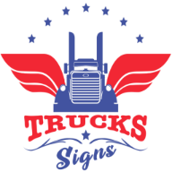
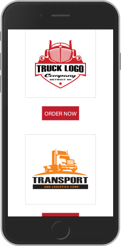

<div align="center">



# 🚛 Truck Signs API

**Professional E-Commerce API for Custom Truck Vinyl Signs & Letterings**

[](https://python.org)
[](https://djangoproject.com)
[](https://django-rest-framework.org)
[](https://docker.com)
[](LICENSE)

**🌐 Live Demo:** [http://91.99.193.112:8020](http://91.99.193.112:8020)  
**📋 Admin Panel:** [http://91.99.193.112:8020/admin](http://91.99.193.112:8020/admin)

---

</div>

## 🎯 **Overview**

**Truck Signs API** is a comprehensive, production-ready e-commerce backend solution designed specifically for custom truck vinyl signs and letterings. Built with modern Django REST Framework architecture, this API powers a complete online store where customers can purchase pre-designed vinyls, upload custom designs, and personalize truck letterings with professional-grade customization tools.

### ✨ **Key Features**

- 🛒 **Complete E-Commerce Solution** - Full cart, checkout, and payment processing
- 🎨 **Custom Design Upload** - Client-side design upload and customization
- 📱 **RESTful API Architecture** - Clean, scalable API endpoints
- 🔐 **Stripe Payment Integration** - Secure payment processing
- 📧 **Email Notifications** - Automated order confirmations
- 🖼️ **Image Management** - Cloudinary integration for media storage
- 🐳 **Docker Ready** - Complete containerization with production deployment
- 🔒 **Production Security** - HTTPS, CORS, and security best practices
- 📊 **Admin Dashboard** - Comprehensive Django admin interface

---

## 🏗️ **Architecture & Technology Stack**

### **Backend Framework**
- **Django 2.2.8** - Robust web framework
- **Django REST Framework 3.12.4** - API development toolkit
- **Python 3.8+** - Modern Python runtime

### **Database & Storage**
- **PostgreSQL** - Primary database (production)
- **SQLite** - Development/testing database
- **Cloudinary** - Cloud-based image storage and optimization

### **Payment & Communication**
- **Stripe API** - Secure payment processing
- **SMTP Email** - Automated notifications

### **DevOps & Deployment**
- **Docker** - Containerization and deployment
- **Gunicorn** - WSGI HTTP Server
- **WhiteNoise** - Static file serving
- **CORS Headers** - Cross-origin request handling

### **Security & Performance**
- **Environment Variables** - Secure configuration management
- **HTTPS Ready** - SSL/TLS support
- **Static File Optimization** - Compressed and cached assets

---

## 🚀 **Quick Start with Docker**

### **Prerequisites**
- Docker installed on your system
- Git for cloning the repository

### **1. Clone the Repository**
```bash
git clone <repository-url>
cd truck_signs_api-main
```

### **2. Environment Configuration**
```bash
# Copy the example environment file
cp docker.env.example docker.env

# Edit the environment variables (required)
nano docker.env
```

### **3. Build and Run with Docker**
```bash
# Build the Docker image
docker build -t truck-signs-api:latest .

# Run the container
docker run -d \
  --name truck-signs-api \
  -p 8020:8000 \
  --env-file docker.env \
  --restart unless-stopped \
  truck-signs-api:latest
```

### **4. Access Your Application**
- **API Base URL:** http://localhost:8020
- **Admin Panel:** http://localhost:8020/admin
- **API Documentation:** http://localhost:8020/truck-signs/

---

## 🛠️ **Development Setup**

### **Local Development**
```bash
# Create virtual environment
python -m venv venv
source venv/bin/activate  # Linux/Mac
# or
venv\Scripts\activate     # Windows

# Install dependencies
pip install -r requirements.txt

# Configure environment variables
cd truck_signs_designs/settings
cp simple_env_config.env .env
# Edit .env with your configuration

# Run migrations
python manage.py migrate

# Create superuser
python manage.py createsuperuser

# Start development server
python manage.py runserver
```

### **Required Environment Variables**
```bash
# Django Configuration
SECRET_KEY=your-secret-key-here
DEBUG=True
DJANGO_ALLOWED_HOSTS=localhost,127.0.0.1

# Database (PostgreSQL)
DB_NAME=trucksigns_db
DB_USER=trucksigns_user
DB_PASSWORD=your-password
DB_HOST=localhost
DB_PORT=5432

# Payment Processing
STRIPE_PUBLISHABLE_KEY=pk_test_your_key
STRIPE_SECRET_KEY=sk_test_your_key

# Email Configuration
EMAIL_HOST_USER=your-email@gmail.com
EMAIL_HOST_PASSWORD=your-app-password

# Media Storage (Optional)
CLOUD_NAME=your-cloudinary-name
CLOUD_API_KEY=your-api-key
CLOUD_API_SECRET=your-api-secret
```

---

## 📊 **Database Models & Architecture**

### **Core Models**

#### **🏷️ Category**
Product categories for different vinyl types (Truck Logo, Fire Extinguisher, etc.)

#### **📦 Product**
Main product model with pricing, images, and category relationships

#### **✍️ Lettering System**
- **LetteringItemCategory** - Types of letterings (Company Name, VIN Number, etc.)
- **LetteringItemVariation** - Customer text input for each lettering type
- **ProductVariation** - Complete product with customer customizations

#### **🛒 Order Management**
- **Order** - Customer orders with contact and shipping information
- **Payment** - Stripe payment processing and tracking

#### **💬 Customer Interaction**
- **Comment** - Customer reviews and feedback system

---

## 🌐 **API Endpoints**

### **Product Management**
```
GET    /truck-signs/categories/          # List all categories
GET    /truck-signs/categories/{id}/     # Category details
GET    /truck-signs/products/            # List all products
GET    /truck-signs/products/{id}/       # Product details
POST   /truck-signs/products/            # Create product (admin)
```

### **Order Processing**
```
POST   /truck-signs/orders/              # Create new order
GET    /truck-signs/orders/{id}/         # Order details
POST   /truck-signs/payments/            # Process payment
```

### **Custom Designs**
```
POST   /truck-signs/upload-design/       # Upload custom design
POST   /truck-signs/lettering-items/     # Add lettering variations
```

### **Customer Features**
```
GET    /truck-signs/comments/            # Product reviews
POST   /truck-signs/comments/            # Submit review
```

---

## 🖼️ **Screenshots**

### **Admin Panel - Desktop View**

<div align="center">


*Modern Django Admin Interface with Custom Styling*

</div>

---

<div align="center">


*Product Management Interface*

</div>

---

<div align="center">


*Order Management and Analytics*

</div>

### **Admin Panel - Mobile Responsive**

<div align="center">

  

*Fully Responsive Mobile Admin Interface*

</div>

### **Frontend Integration Examples**

<div align="center">


*Mobile Landing Page Integration*

</div>

---

<div align="center">


*Product Grid Layout*

</div>

---

<div align="center">

 

*Mobile Product Grid Views*

</div>

---

<div align="center">


*Product Detail Page*

</div>

---

<div align="center">

 

*Mobile Product Detail and Customization Form*

</div>

---

<div align="center">


*Pricing and Service Overview*

</div>

---

<div align="center">


*Mobile Pricing Layout*

</div>

---

## 🚢 **Production Deployment**

### **Docker Production Setup**

The application is fully containerized and production-ready:

```bash
# Production environment file
cp docker.env.production docker.env

# Build production image
docker build -t truck-signs-api:production .

# Deploy with production settings
docker run -d \
  --name truck-signs-api-prod \
  -p 80:8000 \
  --env-file docker.env \
  --restart unless-stopped \
  truck-signs-api:production
```

### **Production Features**
- ✅ **Security Headers** - HSTS, XSS Protection, Content Type Sniffing
- ✅ **Static File Optimization** - WhiteNoise with compression
- ✅ **Database Optimization** - PostgreSQL with connection pooling
- ✅ **Error Handling** - Comprehensive logging and monitoring
- ✅ **Auto-restart** - Container restart policies
- ✅ **Environment Isolation** - Secure environment variable management

---

## 🔧 **Development Enhancements**

### **What We've Added**

#### **🐳 Complete Docker Integration**
- Multi-stage Dockerfile for optimized builds
- Production-ready container configuration
- Environment-specific settings management
- Automated static file collection and database migrations

#### **🔒 Enhanced Security**
- WhiteNoise middleware for secure static file serving
- CORS configuration for cross-origin requests
- Environment-based settings isolation
- Secure secret key management

#### **⚡ Performance Optimizations**
- Static file compression and caching
- Database query optimization
- Gunicorn WSGI server configuration
- Optimized Docker image layers

#### **📱 API Improvements**
- RESTful endpoint standardization
- Comprehensive error handling
- Response optimization
- CORS support for frontend integration

#### **🛠️ DevOps Ready**
- Automated deployment scripts
- Health check endpoints
- Logging configuration
- Container orchestration support

---

## 🤝 **Contributing**

We welcome contributions! Please follow these steps:

1. **Fork the repository**
2. **Create a feature branch** (`git checkout -b feature/amazing-feature`)
3. **Commit your changes** (`git commit -m 'Add amazing feature'`)
4. **Push to the branch** (`git push origin feature/amazing-feature`)
5. **Open a Pull Request**

### **Development Guidelines**
- Follow PEP 8 Python style guidelines
- Write comprehensive tests for new features
- Update documentation for API changes
- Ensure Docker compatibility

---

## 📚 **Documentation & Resources**

### **API Documentation**
- **Interactive API Docs:** [http://91.99.193.112:8020/truck-signs/](http://91.99.193.112:8020/truck-signs/)
- **Admin Interface:** [http://91.99.193.112:8020/admin/](http://91.99.193.112:8020/admin/)

### **Technology Documentation**
- [Django Official Documentation](https://docs.djangoproject.com/)
- [Django REST Framework](https://www.django-rest-framework.org/)
- [Docker Documentation](https://docs.docker.com/)
- [Stripe API Documentation](https://stripe.com/docs/api)
- [Cloudinary Documentation](https://cloudinary.com/documentation/)

### **Deployment Guides**
- [Digital Ocean Django Deployment](https://www.digitalocean.com/community/tutorials/how-to-set-up-django-with-postgres-gunicorn-and-nginx-on-ubuntu)
- [Docker Production Best Practices](https://docs.docker.com/develop/dev-best-practices/)

---

## 📄 **License**

This project is licensed under the MIT License - see the [LICENSE](LICENSE) file for details.

---

## 👥 **Support & Contact**

- **Issues:** [GitHub Issues](https://github.com/your-repo/issues)
- **Documentation:** [Wiki](https://github.com/your-repo/wiki)
- **Email:** support@trucksigns.com

---

<div align="center">

**Built with ❤️ using Django REST Framework**

*Professional E-Commerce API for the Modern Web*

[](https://python.org)
[](https://djangoproject.com)
[](https://docker.com)

</div>